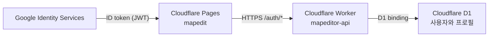

# 배포 아키텍처

## 관리 지점

맵 에디터는 다음 세 리소스를 서로 독립적으로 관리하고 배포한다.

| 관리 지점 | 이름·주소 | 책임 | 변경 수단 |
|---|---|---|---|
| Cloudflare Pages | `mapedit` / `https://mapedit.pages.dev` | 정적 맵 편집 UI와 공개 이미지 제공 | 로컬 빌드 후 Wrangler Direct Upload |
| Cloudflare Worker API | `mapeditor-api` | Google 로그인 검증, 서비스 세션과 프로필 API 제공, D1 접근 | Wrangler Worker 배포 |
| Cloudflare D1 | `mapeditor-db` | 인증 사용자와 프로필 이름 저장, 향후 맵·청크 payload 저장 | Wrangler 마이그레이션 |

Pages는 D1에 직접 접근하지 않는다. 브라우저는 `mapeditor-api`의 공개 HTTPS API만 호출하고, Worker만 D1 바인딩을 통해 데이터에 접근한다. 현재 D1에는 로그인 사용자의 계정 식별 정보와 사용자가 변경한 표시 이름만 저장하며 맵 작업 데이터는 아직 저장하지 않는다.



## Google 로그인 구조

로그인은 Google Identity Services의 팝업 방식으로 처리한다.

1. Pages에서 Google 로그인 버튼을 표시한다. 브라우저에서 사용하는 OAuth Client ID는 공개 식별자이며 시크릿으로 간주하지 않는다.
2. 사용자가 팝업에서 로그인하면 Google이 Pages의 JavaScript 콜백에 `response.credential` ID 토큰(JWT)을 반환한다.
3. Pages는 ID 토큰을 `mapeditor-api`의 `POST /auth/google`로 전달한다.
4. Worker는 토큰의 서명, issuer, audience, 만료 시간을 검증한다. audience는 등록한 Google OAuth Client ID와 일치해야 한다.
5. Worker는 Google 계정 식별자를 기준으로 D1 사용자 레코드를 생성하거나 조회하고 서비스 세션을 발급한다. 신규 사용자의 초기 표시 이름은 Google 이름이나 이메일을 사용하지 않고 `새유저`로 저장한다.
6. 로그인 사용자가 계정 설정에서 표시 이름을 바꾸면 Worker API가 해당 이름을 검증하여 D1에 저장한다. 이메일은 일반 페이지에 표시하지 않고 사용자가 프로필 버튼을 눌러 연 계정 정보 창에서만 보여 준다.

이 구성은 OAuth authorization code를 받는 리다이렉트 방식이 아니다. 따라서 Google Cloud Console의 `Authorized redirect URIs`는 비워 두고 `login_uri`도 설정하지 않는다. 팝업 완료 후 별도의 되돌아오기 URL로 이동하지 않으며, 현재 Pages 문서의 JavaScript 콜백이 ID 토큰을 받는다.

Google Cloud Console의 Web application OAuth Client에는 다음 `Authorized JavaScript origins`를 등록한다. Origin에는 경로와 후행 슬래시를 넣지 않는다.

```text
https://mapedit.pages.dev
http://localhost:4173
http://127.0.0.1:4173
```

로컬 origin 두 개는 로컬 로그인을 시험할 때만 필요하다. 이 팝업 로그인만으로는 Google API 접근용 access token 또는 refresh token이 발급되지 않으며 애플리케이션은 Google OAuth Client Secret을 사용하거나 보관하지 않는다. 향후 Google Drive 같은 API 권한이 필요해 authorization code 흐름을 추가할 때에는 Worker 콜백 주소를 확정하고 그 주소를 `Authorized redirect URIs`에 별도로 등록한다.

## Cloudflare Pages

- 정적 HTML, CSS, JavaScript, 타일과 이미지 자산만 제공한다.
- Worker Secret, D1 바인딩 또는 서버 전용 코드를 포함하지 않는다.
- Google OAuth Client ID와 Worker API 기본 주소처럼 브라우저가 알아야 하는 값은 공개 설정으로 취급한다.
- GitHub Actions와 Pages Git 자동 배포를 사용하지 않는다.
- 정적 검사에 성공한 빌드 산출물만 Wrangler로 `mapedit` 프로젝트에 Direct Upload 한다.

```powershell
npx wrangler pages deploy .\apps\web\dist --project-name mapedit --branch main
```

## Cloudflare Worker API

- Worker 이름은 `mapeditor-api`를 사용한다.
- 로그인 토큰과 요청 origin을 서버에서 검증하고 허용된 Pages origin에만 CORS 응답을 제공한다.
- D1 바인딩을 통해 사용자와 프로필 데이터를 읽고 쓴다.
- 세션 서명 키, 최초 커스텀 토큰 등 민감한 값은 Worker Secrets로 배포한다.
- Google OAuth Client ID는 토큰 audience 검증에 사용하지만 공개 식별자이므로 평문 환경 설정으로 관리해도 된다.
- Pages와 별도로 정적 검사와 테스트를 통과한 뒤 Wrangler로 배포한다.

Worker 배포 주소가 확정되면 Pages의 API 기본 주소와 Worker의 CORS 허용 origin을 함께 확인한다. 운영 CORS에 `*`를 사용하지 않는다.

## Cloudflare D1

- 스키마 변경은 `database/migrations`의 순서가 있는 SQL 파일로 관리한다.
- 새 마이그레이션은 로컬 D1에서 검증한 뒤 원격 D1에 적용한다.
- 애플리케이션 시크릿이나 Google ID 토큰 원문을 저장하지 않는다.
- 현재는 인증 사용자와 변경 가능한 표시 이름만 저장한다.
- 향후 맵 저장을 도입하면 개별 셀 단위가 아니라 청크 payload 단위로 저장한다.

## 시크릿 경계

- 실제 로컬 값은 Git에서 제외된 `.dev.vars`에만 입력한다.
- 버전 관리되는 `secrets.example.env`에는 키 이름과 획득 방법만 기록한다.
- `scripts/Initialize-Secrets.ps1`은 `.dev.vars`가 없을 때만 예시 파일로 생성하며 기존 파일은 덮어쓰지 않는다.
- 배포용 Cloudflare 인증과 애플리케이션 시크릿을 서로 재사용하지 않는다.
- 배포 스크립트와 로그는 시크릿 값을 출력하지 않는다.

## 검증과 배포 순서

세 관리 지점은 각각 독립적으로 다음 순서를 따른다.

1. 대상 코드와 마이그레이션을 로컬에서 검증한다.
2. 프로젝트에 정의된 정적 검사를 실행한다.
3. D1 변경이 있으면 로컬 검증 후 원격 마이그레이션을 적용한다.
4. Wrangler로 해당 Pages 또는 Worker를 배포한다.
5. 운영 주소에서 핵심 동작을 확인한다.
6. 모든 단계가 성공한 경우에만 영어 메시지로 커밋하고 현재 브랜치를 푸시한다.

운영 배포에는 저장소 루트의 PowerShell 스크립트를 사용한다.

```powershell
.\scripts\Deploy-Worker.ps1
.\scripts\Deploy-Pages.ps1 -ApiBaseUrl '<DEPLOYED_WORKER_ORIGIN>'
```

Worker 스크립트는 로컬·원격 D1 마이그레이션, 필요한 Worker Secrets 등록과 Worker 배포를 처리한다. Pages 스크립트는 빌드 후 Git에서 제외된 `.dev.vars`의 공개 Google Client ID와 전달받은 Worker 주소를 배포 산출물의 `app-config.json`에 주입한다.

정적 검사, 원격 마이그레이션 또는 배포가 실패하면 커밋과 푸시를 진행하지 않는다. Pages 배포 실패가 Worker와 D1에 영향을 주거나, Worker 배포 실패가 Pages를 되돌리게 만드는 결합 구조를 만들지 않는다.

## 참고 문서

- Cloudflare Pages Direct Upload: https://developers.cloudflare.com/pages/get-started/direct-upload/
- Cloudflare D1: https://developers.cloudflare.com/d1/
- Google Identity Services 버튼: https://developers.google.com/identity/gsi/web/guides/display-button
- Google Identity Services JavaScript API: https://developers.google.com/identity/gsi/web/reference/js-reference
